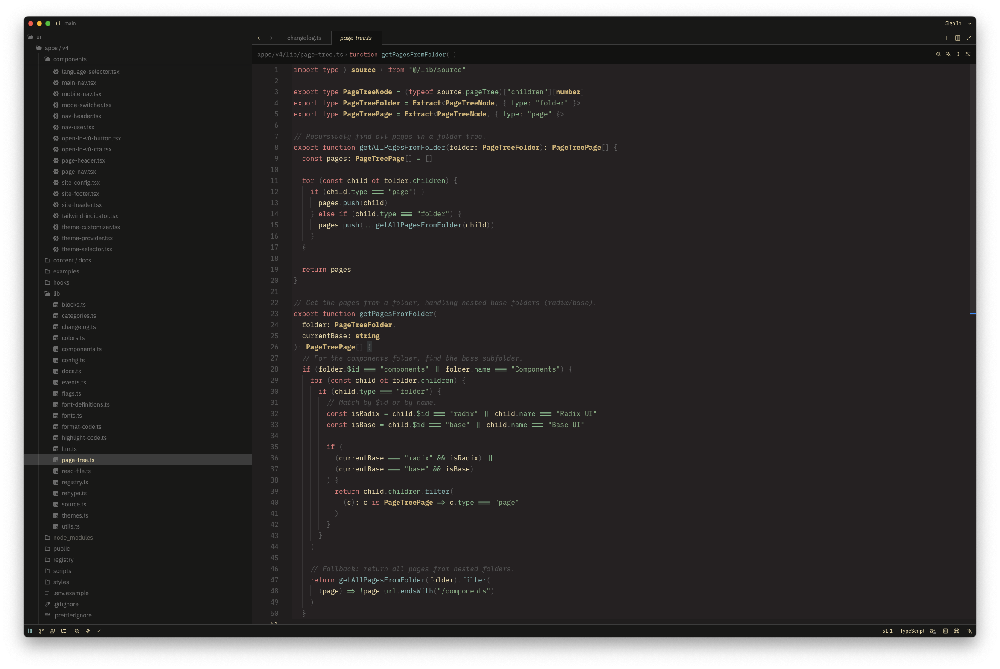

  

_Unknown by many, loved by all_

---

<table>
  <tr>
    <td align="center" width="100%">
      <h3>Miramare</h3>
      
      The beloved warm tone theme
    </td>
  </tr>
</table>

---

## 🚀 Installation

1. Open Zed editor
2. Press `Cmd+Shift+P` (macOS) or `Ctrl+Shift+P` (Linux/Windows)
3. Type "Extensions" and select "zed: extensions"
4. Search for "Miramare"
5. Click "Install"

---

## Versions

- Miramare for VIM: [miramare](https://github.com/franbach/miramare)
- Miramare for VSCode: [miramare-vscode](https://github.com/franbach/miramare-vscode)

---

  Made with ❤️ for the Zed community

